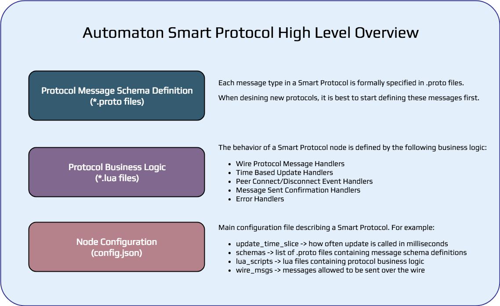

## Chat protocol description:



When two nodes connect to each other they exchange Hello message containing their names. Each of them saves the new
contact in a table of contacts mapping peer id with name. [...]

#### 1. Create a protocol folder
Create a folder named chat under src/automaton/examples/smartproto/. Add the path to the newly created protocol folder in coreinit.json file (.../automaton-core/src/automaton/core/coreinit.json). This file contains the protocols that will be loaded when core is started.

coreinit.json:
```Json
{
  "protocols" : [
    "automaton/examples/smartproto/chat/"
  ]
}
```
* It is not necessary the protocol folder to be in the project tree, could be anywhere.

#### 2. Create these files in the protocol folder:

##### chat.proto
Defines the proto messages available in this protocol.

```
syntax = "proto3";

message Hello {
  string name = 1;
}

message Msg {
  string author = 1;
  uint64 sequence = 2;
  string msg = 3;
}
```

- ``Hello`` Exchanged when two nodes connect. It contains only a string - sender's *name*.

- ``Msg`` Created randomly by every peer in the update function and sent to everybody else. It contains TODO:

  * the node id/author
  * sequence number (...)
  * message from predefined sequence of messages (see *messages.lua*)


##### config.json
The main configuration file

```Json
{
  "update_time_slice": 10,

  "schemas": [
    "chat.proto"
  ],

  "lua_scripts": [
    "messages.lua",
    "connections.lua",
    "chat.lua"
  ],

  "wire_msgs": [
    "Hello", "Msg"
  ]
}
```

``update_time_slice`` How often update is called in milliseconds.

``schemas``  The *.proto files where all used messages are defined.

``lua_scripts`` *.lua files containing protocol source code

``wire_msgs`` All messages that will be sent over the network must be declared here.


##### init.lua
Protocol configuration file containing source code. In this example this file has only the protocol node constructor.

This file must exist even if it is empty and should NOT be included in the json configuration file.

```Lua
-- chat init.lua

function chat_node(id)
  local n = node(id, "automaton/examples/smartproto/chat/")

  _G[id] = {
    node_type = "chat",

    disconnect_all = function()
      n:call("disconnect_all()")
    end,

    connect = function(peer_id)
      n:call("connect("..tostring(peer_id)..")")
    end,
  }

  return n
end
```

##### *.lua files
Files containing protocol source code and the implemented mandatory functions. These files must be included in the json configuration file under "lua_scripts".

The following are the mandatory functions that need to be defined in any of the *.lua files:

* ``update(update_time_slice)`` Called every 10 milliseconds (*update_time_slice* defined in config.json).

* ``connected(peer_id)`` Called when a peer connects.

* ``disconnected(peer_id)`` Called when a peer disconnects.

* ``sent(peer_id, msg_id, success)`` Confirmation if a sent message has been received by the peer.

* ``on_<message_type>(peer_id, message)`` Called when <message_type> is received. The peer id and the received message will be passed.
---

##### connections.lua
Contains network related functions and data structures.

 When a peer connects, it's added to a table of connected peers and *Hello* message containing nodeid(name) is sent.

 After *Hello* message is received from a peer, its nodeid(name) is saved

 If the peer disconnects, *disconnected* is called and the node is removed from the table.

```Lua
-- Keeps track of the currently connected peers

peers = {}
peers[0] = { name = "ME!" }

function connected(peer_id)
  log("connections", "CONNECTED TO " .. tostring(peer_id))
  peers[peer_id] = { name = "N/A" }
  hi = Hello()
  hi.name = nodeid
  send(peer_id, hi, 1)
end

function disconnected(peer_id)
  log("connections", "DISCONNECTED FROM " .. tostring(peer_id))
  peers[peer_id] = nil
end

function on_Hello(peer_id, m)
  log("on_Hello", "Hello from " .. m.name)
  peers[peer_id].name = m.name
end

```

##### chat.lua

We define the update function that will be called every 10 milliseconds. Every 200 to 1000 calls, node generates a message *Msg* and calls on_Msg.

 On_Msg is called with peer_id = 0 meaning the node got the message from itself. On_Msg function is called when *Msg* is received from a peer. If the node doesn't have that message yet (haven't received it), the message is saved and send to every peer except the one from whom it was received (*gossip* function).

```Lua
-- chat.lua

-- initialize protocol
msgs = {}
msg_index = 0
global_seq = 0
math.randomseed(os.time())

-- gossip - sends to everyone but the specified peer_id
function gossip(peer_id, msg)
  for k, v in pairs(peers) do
    if k ~= 0 and k ~= peer_id then
      log("sending", peers[peer_id].name .. " -> " .. msg.msg)
      global_seq = global_seq + 1
      send(k, msg, global_seq)
    end
  end
end

function sent(peer_id, msg_id, success)
  -- log("sent",
  --   string.format("Sent to %s (%d), success: %s", peers[peer_id].name, msg_id, tostring(success))
  -- )
end

function on_Msg(peer_id, m)
  hash = hex(sha3(m.author .. m.msg))
  msg = string.format("<%s>: %s [FROM %s] [%s]",
      m.author, m.msg, peers[peer_id].name, hash)
  if msgs[hash] == nil then
    msgs[hash] = m.msg
    log("CHAT", msg)
    gossip(peer_id, m)
  else
    log("IGNORED", "[Already received] " .. msg)
  end
end

-- wait a bit between generating and sending chat messages
wait = math.random(200,1000)
function update(timestamp)
  wait = wait - 1
  if wait <= 0 then
    wait = math.random(200,1000)
    m = Msg()
    msg_index = msg_index + 1
    local idx = ((msg_index - 1) % #msg_contents) + 1

    m.sequence = msg_index
    m.author = nodeid;
    m.msg = msg_contents[idx] .. " (" .. tostring(msg_index) .. ")"
    on_Msg(0, m)
  end
end
```


##### messages.lua
Contains predefined strings that are sent between nodes.

```Lua
-- Messages used in the chat example

msg_contents = {
  "Hello",
  "How are you?",
  "I'm doing fine. Thanks!",
  "I've got something interesting to tell you",
  "Once upon a time, I requested to join a chat",
  "However the chat group didn't receive my request",
  "So, I was wondering if you could tell me what happened.",
  "I'm really upset and can't believe it",
  "Let's help each other out.",
  "And sure, I'll do the same for you",
  "Ok, talk to you soon."
}
```
---

#### 3. Run the smart protocol

[TODO ...]

Now testnet function could be called with *chat_node* to create test network running this protocol.

```
// starts a test network using localhost tcp connections and running this protocol. Starts 15 nodes, each of which
// requests connection with 2 other and logings go to *<project folder>/src/logs/chat/*

testnet(localhost, chat_node, 15, 2, \"logs/chat/\")"
```
