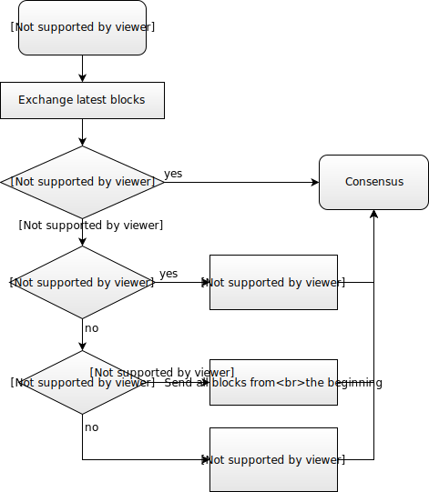

# Valid block is a block that:
## 1. Is a new block, with valid hash and height >= 1
## 2. Either prev_hash is in blocks or the block is with height #1 and prev_hash is GENESIS_HASH
## 3. Has height difference of one with the blocks[prev_hash].height or it is block#1 with prev_hash equal to GENESIS_HASH

